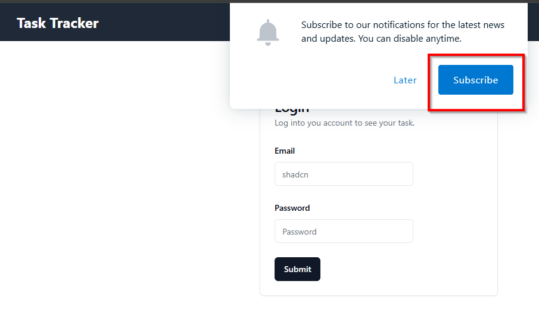
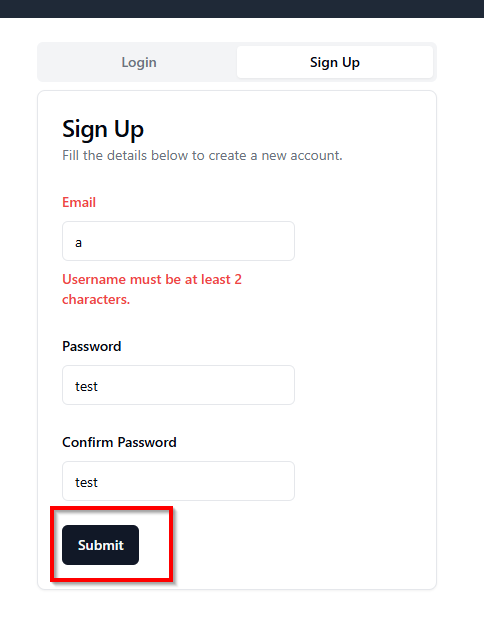
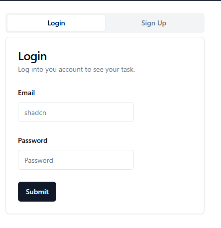
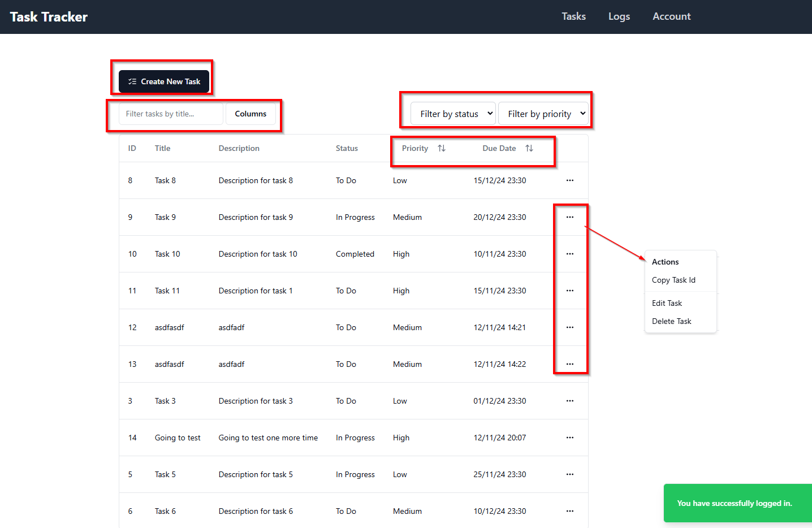
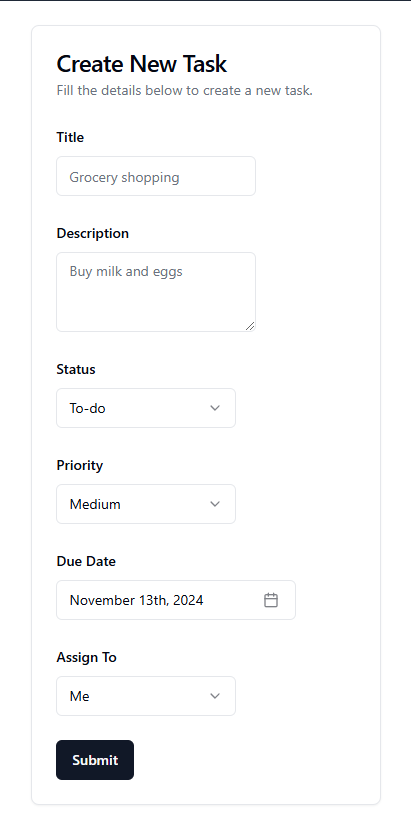
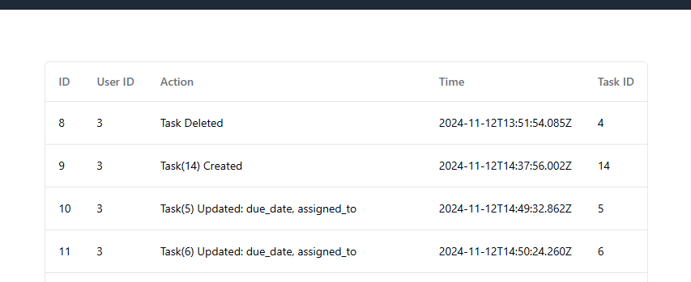
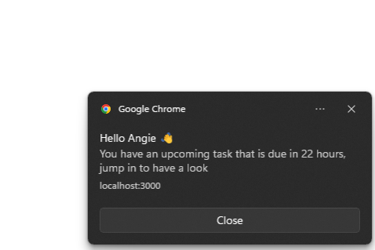

# TASK TRACKER

## Overview
TASK TRACKER is a task management application that helps users to keep track of their tasks, assign tasks to others, receive timely notifications, and manage task deadlines. It offers a seamless user experience through its powerful front-end and robust backend architecture.

## How to Run APP

To run the application locally using Docker, follow the steps below:

1. Clone the repository:
   ```bash
   git clone https://github.com/angiee39/task-tracker
   cd task-tracker

2. Replace the contents of the .env files in both the frontend and backend projects with the ones provided to you, or you can set up your own environment variables as needed(more info on that later).

3. Install Docker on your local machine by following the instructions here:
   Get Docker

4. In the root directory (where the docker-compose.yml file is located), run the following command to build and start the containers:
   ```bash
   docker-compose up --build

5. Once the containers are up and running, you can access the frontend and backend apps at the following URLs:
  - Frontend: http://localhost:3000
  - Backend: http://localhost:5000

## Usage

1. You can accept to receive notifications when you first visit the app.



2. You can then fill in your details and sign up for an account and then log in. 



3. Then you will come to the main screen where the tasks data table is. Here you can;
 - Search task by title and description, 
 - Filter task by status and priority 
 - Sort task by priority and due date.
 - Go to actions where you can edit and delete tasks



4. This is the create/edit task screen, you can add a title, description, status, priority 
    and due date for the task. Your can either assign this to yourself of anyone else who has signed
   for this app.



5. Then you have the logs screen, where you can see the details of tasks created or edited by everyone
   in the app like what actions were created and by whom.



6. Finally you have the account screen where you can log out, edit your details and enable or disable notifications.




## Tech Stack

### Frontend
- **Language**: TypeScript  
  TypeScript provides type safety and scalability for large codebases, reducing bugs and improving developer productivity.

- **UI Framework**: React  
  React offers a component-based architecture, making it easy to build reusable UI components and manage complex states.

- **Web Framework**: Next.js (App Router)  
  Next.js enhances React with server-side rendering, static site generation, and API routes. It improves performance and SEO while streamlining full-stack development.

- **CSS**: Tailwind CSS, Radix UI, ShadCN UI
    - **Tailwind CSS**: A utility-first CSS framework that provides flexibility and faster styling without writing custom CSS.
    - **Radix UI**: A set of accessible and customizable UI components that speed up development.
    - **ShadCN UI**: Provides a solid foundation of components with full customization, simplifying UI development.

- **Main Packages**:
    - **React Query**: React Query is a data-fetching and state management library for React. It simplifies the process of fetching, caching, and synchronizing server data in your app. It helps manage asynchronous data with minimal boilerplate, making it easy to work with RESTful APIs
    - **React Hook Form**: Efficient form management with minimal re-renders, enhancing performance.
    - **OneSignal**: A powerful and easy-to-integrate notification service, perfect for real-time user engagement.
    - **Zod**: Zod is a TypeScript-first schema declaration and validation library. It simplifies form validation by providing easy-to-use schemas for validating user input, ensuring data integrity in the app.

### Backend
- **Language**: JavaScript (Node.js)  
  Node.js allows for non-blocking, asynchronous programming, making it ideal for building scalable and fast server-side applications.

- **Web Framework**: Express.js  
  A minimalist framework that is easy to use, flexible, and allows for rapid API development.

- **Authentication**: JSON Web Tokens (JWT)  
  JWT offers a stateless and secure authentication mechanism, simplifying the management of user sessions.

- **Database**: PostgreSQL  
  PostgreSQL is a powerful, open-source relational database that supports advanced data types and performance optimization, making it suitable for complex queries and data handling.

- **Deployment**: Docker  
  Docker ensures consistency across different environments and simplifies the deployment process by containerizing the entire application.

- **Main Packages**:
  - **bcryptjs**: A JavaScript library used for hashing passwords. It ensures secure storage of user passwords by encrypting them with strong hashing algorithms.
  - **CORS**: CORS (Cross-Origin Resource Sharing) is a middleware that enables your server to handle requests from different origins, allowing the front end to communicate with the back end in a secure way.
  - **Sequelize**: Sequelize is a promise-based ORM for Node.js, making it easier to interact with PostgreSQL. It provides a clean and easy-to-use syntax for defining models, associations, and handling database queries.

- **Additional Features**:
    - **Notifications**: OneSignal is integrated to send notifications, ensuring timely task reminders for users.
    - **Cron job**: Regular cron jobs run to notify users about upcoming tasks, automating background tasks for better user engagement.
    
## Why This Stack?

- **Scalability**: TypeScript, Next.js, and Node.js provide strong foundations for building scalable applications. React’s component-based architecture and reusable hooks ensure the app can easily grow.
- **Performance**: Next.js and PostgreSQL ensure fast response times and server-side rendering, improving user experience.
- **Development Speed**: Tailwind CSS and Radix UI allow for rapid UI development, while Express.js is simple to set up and extend for API routes.
- **Notifications**: OneSignal simplifies real-time notifications, enhancing user engagement.
- **Maintainability**: The clear separation of front-end and back-end responsibilities, along with TypeScript’s static typing, leads to cleaner, more maintainable code.


## Authentication and Authorization

The application uses **cookie-based authentication** to manage user sessions and protect routes from unauthorized access. Upon successful login, a JWT token is sent via cookies, ensuring that only authenticated users can access protected resources and pages.

- **Password Hashing**: Passwords are securely stored using **bcryptjs**. During user registration and login, passwords are hashed before being saved in the database, providing an additional layer of security.

## How to Run Unit Tests

The application uses **Jest** and **Supertest** for unit testing the backend APIs.

- **Jest**: A testing framework for JavaScript that allows you to write simple, flexible, and powerful tests for various parts of the application.
- **Supertest**: An HTTP assertions library used alongside Jest to test API endpoints by simulating HTTP requests.

To run the tests locally:

1. Make UNIT_TESTS=false in the .env file and in the root of server folder, run:
   ```bash
   npm run test